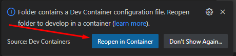
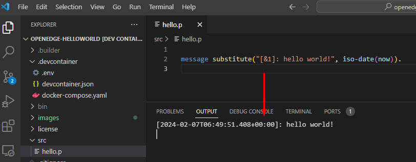

# Openedge Helloworld

## prerequisites 
Een laptop waar op draait/geïnstalleerd is (op het Native OS, niet op een VM):
- Docker
- git (bij voorkeur met de Unix commando's)
- de mogelijkheid om Flusso Gitlab repo te download (maak een access token aan)
- VSCode (met Remote Development extension van Microsoft geïnstalleerd)

## installatie
- creëer een root directory voor de workshop, we noemen deze `<PROJROOT>`, b.v. `c:/proj/cursus` of `/home/johndoe/cursus`
- in een terminal in `<PROJROOT>`: 
```
git clone https://gitlab.flusso.nl/boostermeyer/openedge-helloworld.git
```
- `PROJDIR` = `<PROJROOT>/openedge-helloworld`
- zet progress.cfg in `<PROJDIR>/license` 
- in `<PROJDIR/>/.devcontainer/.env` zet de waardes goed
- `cd` naar `<PROJDIR/>` 
- `code .`
Rechtsonder komt de volgende popup: <br/>

- Klik reopen

Vervolgens moet je, afhankelijk van je internet snelheid, even wachten. Er wordt onderwater een Docker image gedownload en en dat duurt even. <br/>
Als alles klaar is, open `src/hello.p` en druk op F2.



